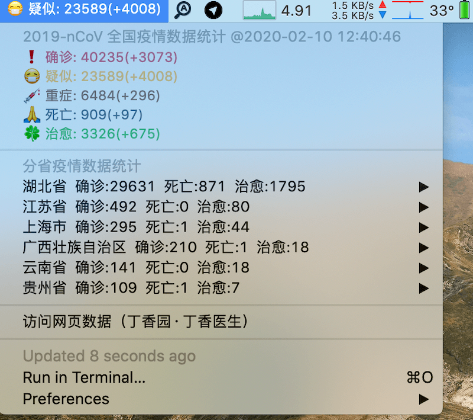

### 基于 Bitbar 的"新型冠状病毒 2019-nCoV "疫情统计插件

#### 预览
菜单栏**滚动**显示 `确诊(+今日新增)`、`疑似(+今日新增)`、`重症(+今日新增)`、`死亡(+今日新增)`、`治愈(+今日新增)`

下拉菜单显示完整疫情数据、数据更新时间、各省份（可自定义）疫情数据



#### 运行环境
- macOS

#### 依赖
- [Bitbar](https://getbitbar.com/)
- cURL
- [brew](https://brew.sh/)
- jq
> cURL: 一般系统自带
> jq: 可通过  `brew install jq` 安装；如果已经通过其他方式（如编译）安装了 jq，则可略过 `brew`

#### 使用
Step 1, 将脚本放到 bitbar 指定的 `Plugin Folder`

Step 2, 确保脚本具有可执行权限。在`终端`执行以下命令即可

```bash
chmod +x 2019-nCoV.10m.sh
```

---

#### 一些客制化的小功能
**刷新时间**
- 默认 10 分钟刷新一次。如果需要调整刷新频率，直接修改文件名即可，如：
```bash
# 修改为 5 分钟
2019-nCoV.10m.sh > 2019-nCoV.5m.sh
# 修改为 1 小时
2019-nCoV.10m.sh > 2019-nCoV.1h.sh
```

**展示的省份**

- 打开脚本文件，修改变量 `province` 的值即可，如：
```bash
# province 的变量值，即省份名称以英文逗号(,)分割、用英文双号("")包裹
# 变量值暂仅支持国内各省、直辖市的名称；可以是简称、也可以是全称，如“湖北省”、“湖北”返回的结果均一致
province='["湖北","上海","云南","贵州","江苏","广西"]'
```

---
#### 数据来源

[丁香园·丁香医生](https://ncov.dxy.cn/ncovh5/view/pneumonia)